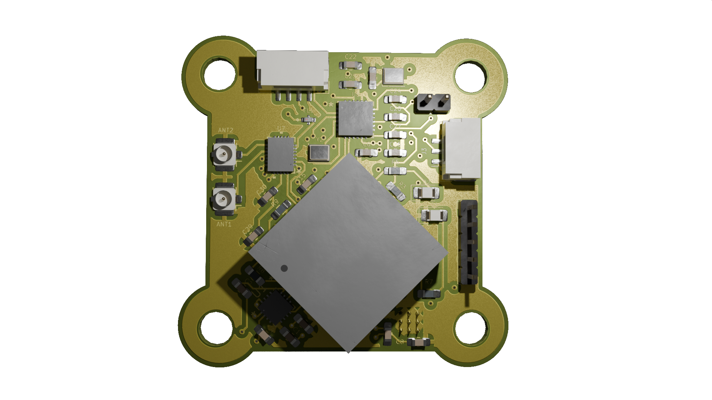

# Custom RX/TX Board Designs for GCS Communication

  

**Receiver and transmitter solution for Ground Control Stations (GCS)**, designed to provide reliable telemetry and control using ELRS, mLRS, and MAVLink protocols. This repository features a wide range of innovative board designs, optimized for long-range communication, minimal latency, and robust performance under varying conditions. From Antenna Diversity to True Diversity and Gemini Mode boards, these designs cater to diverse operational needs and ensure seamless integration with UAV systems. Explore our RX and TX boards tailored to meet the demands of modern UAV telemetry and control systems.

## Table of Contents

1. [QGroundControl Integration](#qgroundcontrol-integration)
2. [Board Designs Overview](#board-designs-overview)
    1. [Antenna Diversity Boards](#1-antenna-diversity-boards)
    - [RX Boards](#rx-boards)
    - [TX Boards](#tx-boards)
    2. [True Diversity or Full Diversity Boards](#2-true-diversity-or-full-diversity-boards)
    - [RX Boards](#rx-boards-1)
    - [TX Boards](#tx-boards-1)
    3. [Gemini Mode Boards](#3-gemini-mode-boards)
    - [RX Boards](#rx-boards-2)
    - [TX Boards](#tx-boards-2)
    4. [Gemini Xrossband (GemX) Boards](#4-gemini-xrossband-gemx-boards)
    - [RX Boards](#rx-boards-3)
    - [TX Boards](#tx-boards-3)
3. [Contributing](#contributing)
4. [Acknowledgments](#acknowledgments)
5. [License](#license)

## QGroundControl Integration

QGroundControl (QGC) is a powerful tool for mission planning and UAV control. This section demonstrates how to use the boards in this repository for telemetry and control with QGC, even without an RC controller.

### Using ELRS Boards with QGC
1. Connect the ground-based ELRS receiver to your GCS using a USB-to-UART adapter.
2. Ensure telemetry is enabled on your flight controller and configured for ELRS.
3. Launch QGC, and verify telemetry data is being received.

### Hardware Setup
Below is an example of the hardware setup for mission planning:
- **Ground Setup**: ELRS transmitter connected to the GCS via USB or mounted on the RC controller.
- **Onboard Setup**: ELRS receiver mounted on the UAV and connected to the flight controller.

> **Note:**  
> - More details about the transmission modes can be found in the [Transmission Modes Classification](Receivers%20and%20Transmitters/README.md).
>
>

> **Note:**  
> - ELRS requires proper binding and configuration to function as a telemetry link.

## Related Projects (click on them to expand)

<!-- 
<em>(click on them to expand)</em>
 -->

<ol style="line-height: 2;">
   <li>

   
<strong>ESP32 UAV Telemetry Monitor</strong>

An ESP32-based telemetry display system for real-time MAVLink UAV monitoring, featuring a responsive touchscreen interface, live flight status visualization, OTA firmware update capability, and seamless integration with QGroundControl, MAVProxy, and other MAVLink-compatible ground stations.

  
  

   
</li>
   <li>

   
<strong>FC Plus Sensor Module</strong>

FC Plus Sensor Module is a modular add-on board for UAV flight controllers, offering advanced features such as telemetry, GPS, object avoidance (ToF, Sonar, IR), and LED indicators for status feedback. This repository includes comprehensive documentation, hardware setup instructions, sensor integration guides, and communication protocols (LoRa/WiFi) to improve UAV autonomy, safety, and performance.

              
  

</ol>

# Board Designs Overview

This repository contains a collection of designs for RX and TX boards under different transmission modes. More details about the transmission modes can be found in the [Transmission Modes Classification](Receivers%20and%20Transmitters/README.md).

    

### 1. Antenna Diversity Boards

### RX Boards

#### ELRS

| Name      | Frequency | Version | Features             | Media | Status |
|-----------|-----------|---------|----------------------|-------|--------|
| AD1_2.4G  | 2.4GHz    | Rev 1.0 | Basic diversity setup | 
  
 | 
✅ Approved
 |
| AD2_900M  | 900MHz    | Rev —   | (Add description)     | 
 (Add links)
 | 
Draft
 |

## 2. True Diversity or Full Diversity Boards

### RX Boards

| Name      | Frequency | Version | Features                         | Media | Status |
|-----------|-----------|---------|-----------------------------------|-------|--------|
| TD1_2.4G  | 2.4GHz    | Rev 1.0 | Full diversity with improved range | 
  
 | 
✅ Approved
 |
| TD2_900M  | 900MHz    | Rev 0.9 | (Add description)                 | 
 (Add links)
 | 
Draft
 |

## TX Boards (Shared for Single Antenna, Antenna Diversity & True Diversity)

> **Note:**  
> The TX boards listed in this section are shared across **Single Antenna Mode, Antenna Diversity, and True Diversity** configurations.  
> - These boards are **not duplicated** under each diversity category to avoid redundancy.  
> - They are optimized for their respective frequencies (**2.4GHz** & **900MHz**) and ensure compatibility across all three configurations.  
> - **Gemini Mode (GM) and Gemini Xrossband (GemX) have their own TX boards**, so they are listed separately in their respective sections.  

### TX Boards  

| Name      | Frequency | Version | Features                                                                 | Media | Status |
|-----------|-----------|---------|--------------------------------------------------------------------------|-------|--------|
| TX1_2.4G  | 2.4GHz    | Rev 1.0 | Basic transmitter with no OLED display or TX Backpack.                   | 
  
 | 
✅ Approved
 |
| TX2_2.4G  | 2.4GHz    | Rev 1.1 | Includes SSD1306 OLED display, but no TX Backpack.                       | 
  
 | 
✅ Approved
 |
| TX3_2.4G  | 2.4GHz    | Rev 1.2 | Features both SSD1306 OLED display and TX Backpack for GCS communication.| 
  
 | 
Draft
 |
| TX1_900M  | 900MHz    | Rev 1.0 | Robust transmitter for 900MHz band, suitable for longer-range links.     | 
  
 | 
Draft
 |

## 3. Gemini Mode Boards  

### RX Boards
> **Note:**  
> - The **Gemini RX boards** are actually the **True Diversity RX boards** operating in **Gemini Mode**.  
> - To enable **Gemini Mode**, set the **RX Antenna Mode** to **Gemini** via Lua script.  
> - **Single Antenna RX boards** can also operate in Gemini Mode but must use **Model 5** in **Model Config Matching** via Lua script.  
> - **Gemini-capable receivers** should use **Model 6** in **Model Config Matching**.  
> - Click on [🔗 **Go to True Diversity Full Diversity RX Boards**](#2-true-diversity-or-full-diversity-boards) to view compatible receivers.  
>  
> 📖 **Reference:** [ExpressLRS Gemini Mode Documentation](https://www.expresslrs.org/software/gemini/#what-is-gemini)  

### TX Boards (Gemini Mode – Single Band)

| Name        | Frequency | Version | Features                                                                                          | Media | Status |
|-------------|-----------|---------|---------------------------------------------------------------------------------------------------|-------|--------|
| G_TX1_2.4G  | 2.4GHz    | Rev 1.0 | Sends packets on two frequencies ~40 MHz apart in the 2.4 GHz band. | 
/G_TX1)  
 | 
✅ Approved
 |
| G_TX1_900M  | 900MHz    | Rev 1.0 | Sends packets on two frequencies ~10 MHz apart in the 900 MHz band. | 
/G_TX1_900M)  
 | 
Draft
 |

## 4. Gemini Xrossband (GemX) Boards  

### RX Boards  

| Name  | Frequency        | Version | Features                                | Media | Status |
|-------|------------------|---------|-----------------------------------------|-------|--------|
| GX1   | 2.4GHz & 900MHz  | Rev 1.0 | Crossband receiver for 2.4GHz and 900MHz | 
  
 | 
Draft
 |

### TX Boards  

| Name   | Frequency        | Version | Features                                      | Media | Status |
|--------|------------------|---------|----------------------------------------------|-------|--------|
| GX_TX1 | 2.4GHz & 900MHz  | Rev 1.0 | Crossband transmitter for 2.4GHz and 900MHz   | 
  
 | 
Draft
 |

## Contributing

Feel free to contribute to this repository by submitting pull requests for new board designs or updates to existing ones.

## Acknowledgments

We would like to thank the following for making this project possible:

- **ELRS (ExpressLRS)**: High-performance, low-latency long-range communication for UAVs.  
- **mLRS (MAVLink Long Range System)**: MAVLink-based long-range telemetry and control extension for ELRS.  
- **MAVLink**: The essential protocol for UAV communication and mission control.  
- **QGroundControl (QGC)**: Open-source ground control software for UAV mission planning. 
- **OpenTX**: Open-source firmware for RC transmitters, enabling extensive customization and telemetry support.  
- **OpenI6X**: A custom OpenTX / EdgeTX port for the Flysky FS-i6X transmitter, expanding its capabilities and MAVLink support.   
- **Other Contributors**: Thanks to all who contributed feedback, bug fixes, and improvements.

These open-source tools and protocols are integral to the success of this project.

## License

This project is licensed under the following:

- **Hardware Designs**: MIT License - see the [LICENSE-HARDWARE](LICENSE-HARDWARE) file for details.
- **Firmware/Software**: GPLv3 License - see the [LICENSE-FIRMWARE](LICENSE-FIRMWARE) file for details.

> **Note:**  
> The firmware you flash onto the hardware uses the **ELRS** and **mLRS**, which are licensed under **GPLv3**. Any modifications or redistribution of the firmware must comply with the terms of the **GPLv3** license.

---

**Thank you for visiting UAV-TelemetryLink!**
