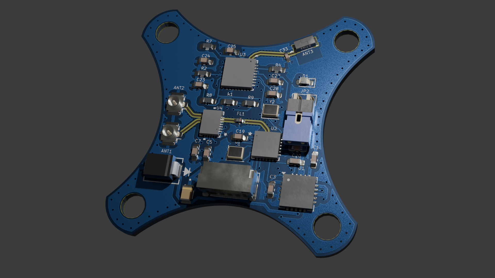
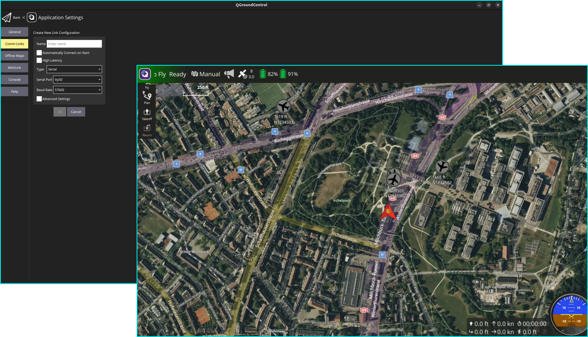

# Custom RX/TX Board Designs for GCS Communication

  

**Receiver and transmitter solution for Ground Control Stations (GCS)**, designed to provide reliable telemetry and control using ELRS, mLRS, and MAVLink protocols. This repository features a wide range of innovative board designs, optimized for long-range communication, minimal latency, and robust performance under varying conditions. From Antenna Diversity to True Diversity and Gemini Mode boards, these designs cater to diverse operational needs and ensure seamless integration with UAV systems. Explore our RX and TX boards tailored to meet the demands of modern UAV telemetry and control systems.

## Table of Contents

1. [QGroundControl Integration](#qgroundcontrol-integration)
2. [Board Designs Overview](#board-designs-overview)
    1. [Antenna Diversity Boards](#1-antenna-diversity-boards)
    - [RX Boards](#rx-boards)
    - [TX Boards](#tx-boards)
    2. [True Diversity Boards](#2-true-diversity-boards)
    - [RX Boards](#rx-boards-1)
    - [TX Boards](#tx-boards-1)
    3. [Gemini Mode Boards](#3-gemini-mode-boards)
    - [RX Boards](#rx-boards-2)
    - [TX Boards](#tx-boards-2)
    4. [Gemini Xrossband (GemX) Boards](#4-gemini-xrossband-gemx-boards)
    - [RX Boards](#rx-boards-3)
    - [TX Boards](#tx-boards-3)
3. [Contributing](#contributing)
4. [Acknowledgments](#acknowledgments)
5. [License](#license)

## QGroundControl Integration

QGroundControl (QGC) is a powerful tool for mission planning and UAV control. This section demonstrates how to use the boards in this repository for telemetry and control with QGC, even without an RC controller.

### Using ELRS Boards with QGC
1. Connect the ground-based ELRS receiver to your GCS using a USB-to-UART adapter.
2. Ensure telemetry is enabled on your flight controller and configured for ELRS.
3. Launch QGC, and verify telemetry data is being received.

### Hardware Setup
Below is an example of the hardware setup for mission planning:
- **Ground Setup**: ELRS transmitter connected to the GCS via USB or mounted on the RC controller.
- **Onboard Setup**: ELRS receiver mounted on the UAV and connected to the flight controller.

> **Note:**  
> - ELRS requires proper binding and configuration to function as a telemetry link.

# Board Designs Overview

This repository contains a collection of designs for RX and TX boards under different transmission modes. More details about the transmission modes can be found in the [Transmission Modes Classification](Receivers%20and%20Transmitters/README.md).

    

## 1. Antenna Diversity Boards

### RX Boards
| Name       | Features                          | Preview                                                       |
|------------|-----------------------------------|------------------------------------------------------------|
| AD1_2.4G   | Basic diversity setup    |   
 Click on the image to view the files 
|
| AD2_900M   |       |    |

### TX Boards
| Name       | Features                          | Preview                                                       |
|------------|-----------------------------------|------------------------------------------------------------|
| AD_TX1_2.4G| Optimized for transmission at 2.4GHz |    |

## 2. True Diversity Boards

### RX Boards
| Name        | Features                          | Preview                                                       |
|-------------|-----------------------------------|------------------------------------------------------------|
| TD1_2.4G    | Full diversity with improved range |    |

### TX Boards
| Name        | Features                          | Preview                                                       |
|-------------|-----------------------------------|------------------------------------------------------------|
| TD_TX1_900M | Robust transmitter for 900MHz      |    |

## 3. Gemini Mode Boards

### RX Boards
| Name         | Features                          | Preview                                                       |
|--------------|-----------------------------------|------------------------------------------------------------|
| GM1_2.4G     | Dual-frequency within 2.4GHz band |    |

### TX Boards
| Name         | Features                          | Preview                                                       |
|--------------|-----------------------------------|------------------------------------------------------------|
| GM_TX1_900M  | Dual-frequency within 900MHz band  |    |

## 4. Gemini Xrossband (GemX) Boards

### RX Boards
| Name         | Features                          | Preview                                                       |
|--------------|-----------------------------------|------------------------------------------------------------|
| GX1          | Crossband receiver for 2.4GHz and 900MHz |    |

### TX Boards
| Name         | Features                          | Preview                                                       |
|--------------|-----------------------------------|------------------------------------------------------------|
| GX_TX1       | Crossband transmitter for 2.4GHz and 900MHz |    |

## Contributing

Feel free to contribute to this repository by submitting pull requests for new board designs or updates to existing ones.

## Acknowledgments

We would like to thank the following for making this project possible:

- **ELRS (ExpressLRS)**: High-performance, low-latency long-range communication for UAVs.  
- **mLRS (MAVLink Long Range System)**: MAVLink-based long-range telemetry and control extension for ELRS.  
- **MAVLink**: The essential protocol for UAV communication and mission control.  
- **QGroundControl (QGC)**: Open-source ground control software for UAV mission planning.  
- **Other Contributors**: Thanks to all who contributed feedback, bug fixes, and improvements.

These open-source tools and protocols are integral to the success of this project.

## License

This project is licensed under the following:

- **Hardware Designs**: MIT License - see the [LICENSE-HARDWARE](LICENSE-HARDWARE) file for details.
- **Firmware/Software**: GPLv3 License - see the [LICENSE-FIRMWARE](LICENSE-FIRMWARE) file for details.

> **Note:**  
> The firmware you flash onto the hardware uses the **ELRS** and **mLRS**, which are licensed under **GPLv3**. Any modifications or redistribution of the firmware must comply with the terms of the **GPLv3** license.

---

**Thank you for visiting UAV-TelemetryLink!**