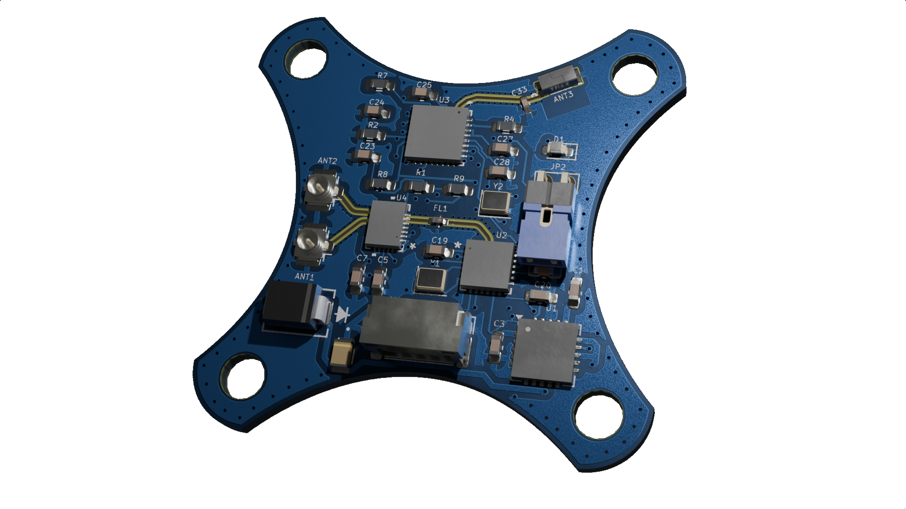

# AD1_2.4G

Antenna Diversity 
(Basic diversity setup)

## Bill of Materials

| **Reference** | **Value**         | **Datasheet** | **Footprint** | **Qty** | **DNP** |
|--------------|------------------|--------------|-------------|------|------|
| AE1         | Antenna          | ~            | RF_Antenna:Texas_SWRA117D_2.4GHz_Right | 1  |      |
| ANT1, ANT2  | Conn_Coaxial     | ~            | Connector_Coaxial:U.FL_Hirose_U.FL-R-SMT-1_Vertical | 2  |      |
| C1, C30, C32 | 10uF            | ~            | Capacitor_SMD:C_0805_2012Metric_Pad1.18x1.45mm_HandSolder,ECASD40J106M055K00:ECASD40J106M055K00 | 3  |      |
| C2          | 1uF             | ~            | Capacitor_SMD:C_0805_2012Metric_Pad1.18x1.45mm_HandSolder | 1  |      |
| C3          | 47uF            | ~            | Capacitor_SMD:C_0805_2012Metric_Pad1.18x1.45mm_HandSolder | 1  |      |
| C4          | 2.2uF           | ~            | Capacitor_SMD:C_0805_2012Metric_Pad1.18x1.45mm_HandSolder | 1  |      |
| C5, C6, C21, C22 | 10pF       | ~            | Capacitor_SMD:C_0805_2012Metric_Pad1.18x1.45mm_HandSolder | 4  |      |
| C7, C16, C17, C23, C24, C25, C26, C27, C28, C29 | 100nF | ~ | Capacitor_SMD:C_0805_2012Metric_Pad1.18x1.45mm_HandSolder | 10 |      |
| C18         | 470nF           | ~            | Capacitor_SMD:C_0805_2012Metric_Pad1.18x1.45mm_HandSolder | 1  |      |
| C19, C20    | 10nF            | ~            | Capacitor_SMD:C_0805_2012Metric_Pad1.18x1.45mm_HandSolder | 2  |      |
| C31         | 0.1uF           | ~            | Capacitor_SMD:C_0805_2012Metric_Pad1.18x1.45mm_HandSolder | 1  |      |
| D1          | LED             | ~            | LED_SMD:LED_0805_2012Metric_Pad1.15x1.40mm_HandSolder | 1  |      |
| FL1         | 2450FM07D0034T  | [Datasheet](https://www.mouser.co.uk/datasheet/2/611/2450FM07D0034-1375634.pdf) | 2450FM07D0034T:2450FM07D0034T | 1 |      |
| J1          | Conn_01x04_Socket | ~           | Connector_Harwin:Harwin_M20-89004xx_1x04_P2.54mm_Horizontal | 1  |      |
| J3          | Conn_01x04_Pin  | ~            | Connector_JST:JST_GH_SM04B-GHS-TB_1x04-1MP_P1.25mm_Horizontal | 1  |      |
| JP1         | Jumper_2_Bridged | ~            | TestPoint:TestPoint_2Pads_Pitch2.54mm_Drill0.8mm | 1  |      |
| R1          | 2.2K            | ~            | Resistor_SMD:R_0805_2012Metric_Pad1.20x1.40mm_HandSolder | 1  |      |
| R2, R3, R7, R8, R10 | 10K     | ~            | Resistor_SMD:R_0805_2012Metric_Pad1.20x1.40mm_HandSolder | 5  |      |
| R4          | 12K             | ~            | Resistor_SMD:R_0805_2012Metric_Pad1.20x1.40mm_HandSolder | 1  |      |
| R5          | 0               | ~            | Resistor_SMD:R_0805_2012Metric_Pad1.20x1.40mm_HandSolder | 1  |      |
| R6          | 1K              | ~            | Resistor_SMD:R_0805_2012Metric_Pad1.20x1.40mm_HandSolder | 1  |      |
| R9          | 1.2K            | ~            | Resistor_SMD:R_0805_2012Metric_Pad1.20x1.40mm_HandSolder | 1  |      |
| U1          | TPS7A4701xRGW   | [Datasheet](https://www.ti.com/lit/ds/symlink/tps7a47.pdf) | Package_DFN_QFN:Texas_RGW0020A_VQFN-20-1EP_5x5mm_P0.65mm_EP3.15x3.15mm_ThermalVias | 1 |      |
| U2          | SX1280IMLTRT    | SX1280IMLTRT | SX1280IMLTRT:QFN24_4X4_SEM | 1 |      |
| U3          | ESP8285H16      | ESP8285H16   | ESP8285H16:QFN32_5X5_EXP | 1 |      |
| U4          | SE2431L-R       | SE2431L-R    | SE2431L-R:SE2431L_SKY | 1 |      |
| Y1          | 52MHz           | ~            | Crystal:Crystal_SMD_2016-4Pin_2.0x1.6mm | 1 |      |
| Y2          | 26MHz           | ~            | Crystal:Crystal_SMD_2016-4Pin_2.0x1.6mm | 1 |      |

[⬅️ Go Back to Main README](https://github.com/TeodoraMiu/UAV-TelemetryLink)