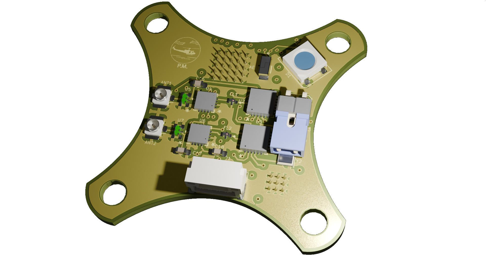

# TD1 at 2.4G

True Diversity or Full Diversity
(Full diversity with improved range)

 or 
  
Click the icons to open iBOM or KiCanvas
 

[⬅️ Go Back to Main README](https://github.com/Paschalis/UAV-TelemetryLink)
